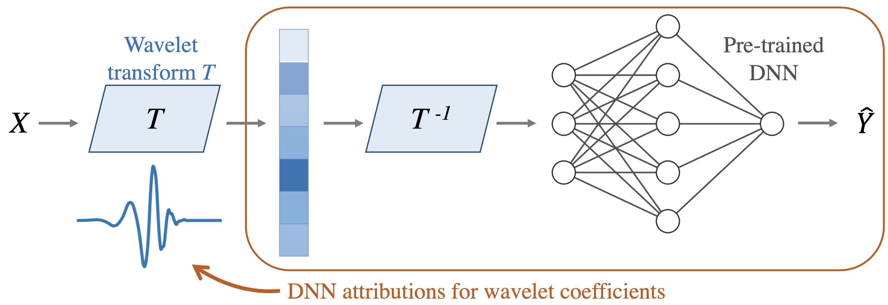

<h1 align="center">    Adaptive wavelets </h1>
<p align="center"> Wavelets which adapt given data (and optionally a pre-trained model). This yields models which are faster, more compressible, and more interpretable.
</p>
<p align="center">
  
  
  
  <a href="https://github.com/csinva/imodels/actions"></a>
  
  
</p>  

# Quickstart

> **Installation**: `pip install awave`
> or clone the repo and run `python setup.py install` from the repo directory

Then, can use the core functions (see simplest example in `notebooks/demo_simple_2d.ipynb` or `notebooks/demo_simple_1d.ipynb`). See [the docs](https://yu-group.github.io/adaptive-wavelets/) for more information on arguments for these functions.

Given some data `X`, you can run the following:

```python
from awave.utils.misc import get_wavefun
from awave.transform2d import DWT2d

wt = DWT2d(wave='db5', J=4)
wt.fit(X=X, lr=1e-1, num_epochs=10)  # this function alternatively accepts a dataloader
X_sparse = wt(X)  # uses the learned adaptive wavelet
phi, psi, x = get_wavefun(wt)  # can also inspect the learned adaptive wavelet
```

To distill a pretrained model named `model`, simply pass it as an additional argument to the fit function:

```python
wt.fit(X=X, pretrained_model=model,
       lr=1e-1, num_epochs=10,
       lamL1attr=5) # control how much to regularize the model's attributions
```

# Background

Official code for using / reproducing AWD from the paper "Adaptive wavelet distillation from neural networks through interpretations" ([Ha et al. NeurIPS, 2021](https://arxiv.org/abs/2107.09145)).




> Recent deep-learning models have achieved impressive prediction performance, but often sacrifice interpretability and computational efficiency. Interpretability is crucial in many disciplines, such as science and medicine, where models must be carefully vetted or where interpretation is the goal itself. Moreover, interpretable models are concise and often yield computational efficiency. Here, we propose adaptive wavelet distillation (AWD), a method which aims to distill information from a trained neural network into a wavelet transform. Specifically, AWD penalizes feature attributions of a neural network in the wavelet domain to learn an effective multi-resolution wavelet transform. The resulting model is highly predictive, concise, computationally efficient, and has properties (such as a multi-scale structure) which make it easy to interpret. In close collaboration with domain experts, we showcase how AWD addresses challenges in two real-world settings: cosmological parameter inference and molecular-partner prediction. In both cases, AWD yields a scientifically interpretable and concise model which gives predictive performance better than state-of-the-art neural networks. Moreover, AWD identifies predictive features that are scientifically meaningful in the context of respective domains.

Also provides an implementation for "Learning Sparse Wavelet Representations"([Recoskie & Mann, 2018](https://arxiv.org/abs/1802.02961))

# Related work

- TRIM (ICLR 2020 workshop [pdf](https://arxiv.org/abs/2003.01926), [github](https://github.com/csinva/transformation-importance)) - using simple reparameterizations, allows for calculating disentangled importances to transformations of the input (e.g. assigning importances to different frequencies)
- ACD (ICLR 2019 [pdf](https://openreview.net/pdf?id=SkEqro0ctQ), [github](https://github.com/csinva/hierarchical-dnn-interpretations)) - extends CD to CNNs / arbitrary DNNs, and aggregates explanations into a hierarchy
- CDEP (ICML 2020 [pdf](https://arxiv.org/abs/1909.13584), [github](https://github.com/laura-rieger/deep-explanation-penalization)) - penalizes CD / ACD scores during training to make models generalize better
- DAC (arXiv 2019 [pdf](https://arxiv.org/abs/1905.07631), [github](https://github.com/csinva/disentangled-attribution-curves)) - finds disentangled interpretations for random forests
- PDR framework (PNAS 2019 [pdf](https://arxiv.org/abs/1901.04592)) - an overarching framewwork for guiding and framing interpretable machine learning


If this package is useful for you, please cite the following!

```r
@article{ha2021adaptive,
  title={Adaptive wavelet distillation from neural networks through interpretations},
  author={Ha, Wooseok and Singh, Chandan and Lanusse, Francois and Song, Eli and Dang, Song and He, Kangmin and Upadhyayula, Srigokul and Yu, Bin},
  journal={arXiv preprint arXiv:2107.09145},
  year={2021}
}
